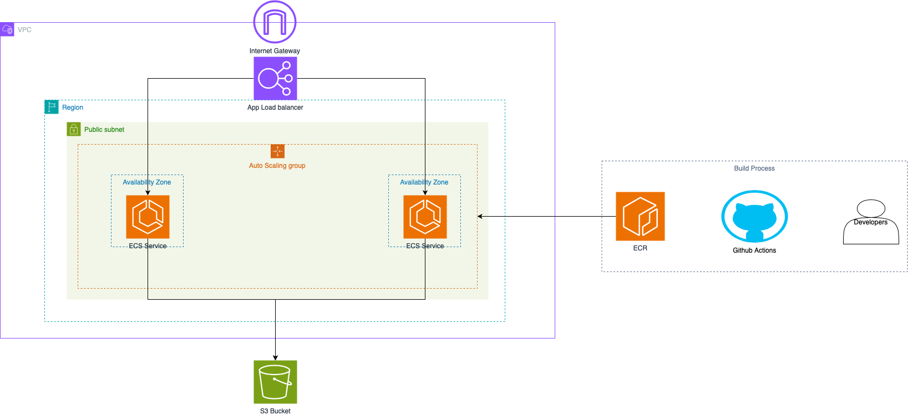

# Terraform Deployment for Flask API

This Terraform project automates the deployment of the Flask API on AWS infrastructure. The deployment includes provisioning resources such as a Virtual Private Network (VPC), Elastic Container Service (ECS) Cluster and Service, Identity and Access Management (IAM) roles, an Elastic Container Registry (ECR), and an S3 bucket. The Flask API is deployed using AWS Fargate on ECS.

## Prerequisites

- [Terraform](https://www.terraform.io/downloads.html) installed on your machine.
- AWS credentials configured with the necessary permissions.

## Architecture Diagram



Provide a visual representation of the architecture. You can use tools like draw.io, Lucidchart, or any other diagramming tool to create the architecture diagram and host it on an image hosting service. Replace `link-to-your-architecture-diagram` with the actual link to your diagram.

## Terraform Modules Overview

### [S3 Bucket Module](./modules/s3)

Manages the creation of an AWS S3 bucket for storing files.

### [ECR Module](./modules/ecr)

Sets up an Elastic Container Registry (ECR) repository to store Docker images.

### [VPC Module](./modules/vpc)

Creates a Virtual Private Cloud (VPC) with specified subnets for the infrastructure.

### [ECS Module](./modules/ecs)

Handles the deployment of the Flask API using AWS Elastic Container Service (ECS) on Fargate.

### [Load Balancer Module](./modules/lb)

Configures an Application Load Balancer (ALB) for distributing traffic to the Flask API.

### [IAM Module](./modules/iam)

Manages Identity and Access Management (IAM) roles and policies for various services.

### [Scaling Module](./modules/scaling)

Implements auto-scaling policies for the ECS cluster based on specified metrics.


## Getting Started

1. **Clone the repository:**

   ```bash
   git clone https://github.com/adesokandijam/devops-assessment.git
   cd devops-assessment/infrastructure

2. **Initialize the terraform:**

   ```bash
   terraform init

3. **Have a view of what is about to be deployed:**

   ```bash
   terraform plan

4. **Deploy the infrastructure:**

   ```bash
   terraform apply

5. **Destroy the infrastructure:**

   ```bash
   terraform destroy


